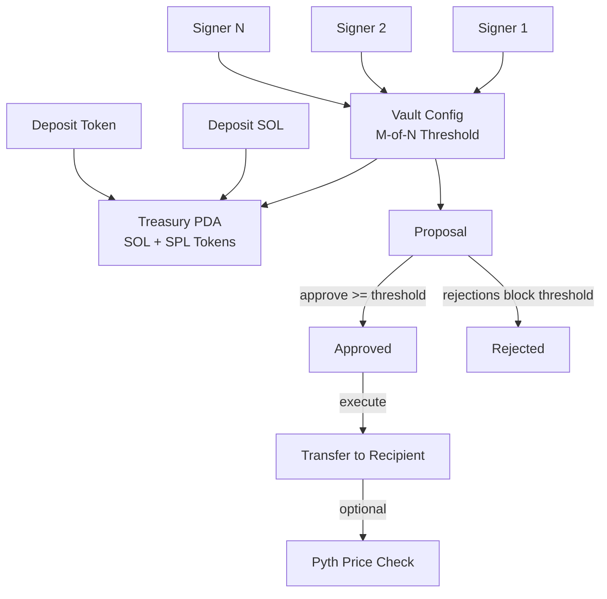
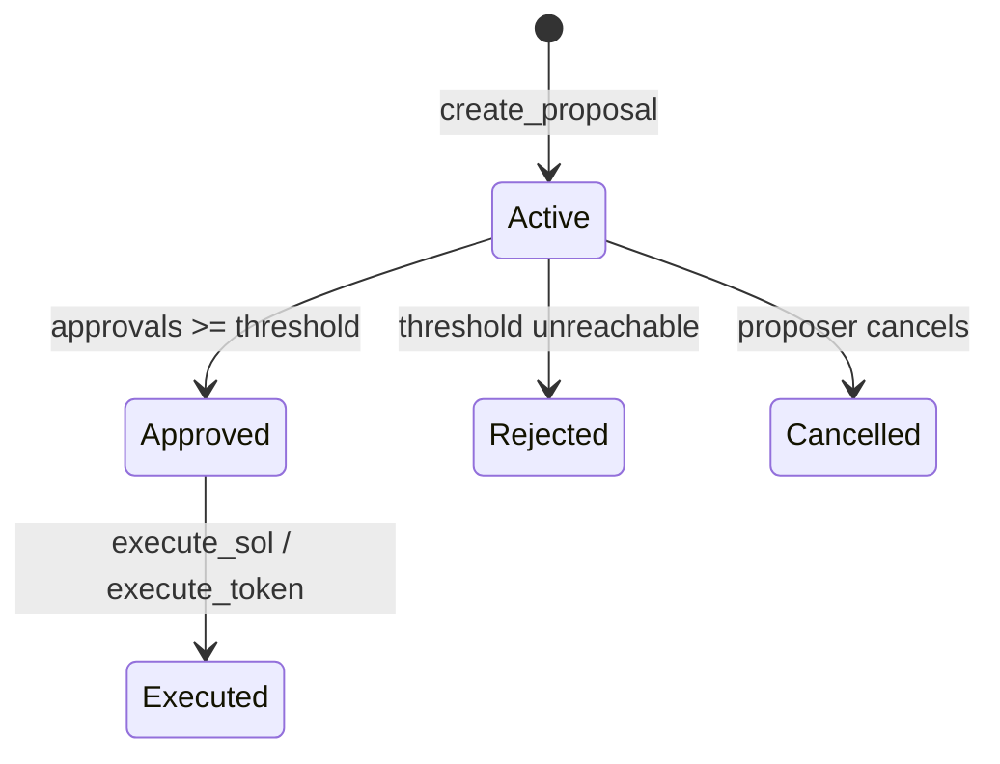

# Multisig Vault

A Solana program for managing shared funds with threshold-based approvals. Built with Anchor.

**Devnet Program ID:** [`EL9AsYrsmVDm4HTd7dCWnJJgadksCGkJfyFCw4WTfaZp`](https://explorer.solana.com/address/EL9AsYrsmVDm4HTd7dCWnJJgadksCGkJfyFCw4WTfaZp?cluster=devnet)

## Overview

Multisig Vault lets a group of signers collectively control a treasury. Transfers require a configurable number of approvals (M-of-N) before execution. Supports both native SOL and SPL token transfers.

Proposals can optionally include Pyth oracle price conditions, gating execution on an asset price falling within a specified range.

## Architecture

## Proposal Lifecycle

A proposal transitions to **Approved** once the approval count reaches the vault threshold. It transitions to **Rejected** when enough signers have rejected that the threshold can no longer be reached. The proposer can **Cancel** their own proposal at any time while it is still active.

